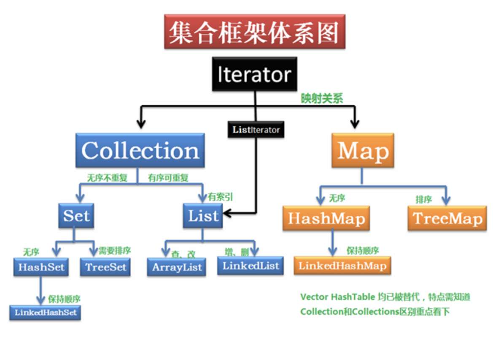

# JAVA SE
## 基本数据类型
### 8大基本数据类型
java 提供8个基本数据类型，boolean byte char short int  long float double 。

在内存中所占的字节数如下：

```
类型     字节数    位数
byte     1         8
short    2         16
int      4         32
long     8         64
float    4         32
double   8         64
char     2         16
boolean  1         8
```


### 基本类型的比较和运算
- 1：基本类型与包装类比较会自动拆箱
- 2：如果两方都为包装类，则不会拆箱，且不能比较，编译会报错；
- 3：  基本类型不能与null做比较
- 4：如果两个操作数其中有一个是double类型，另一个操作就会转换为double类型。

     否则，如果其中一个操作数是float类型，另一个将会转换为float类型。
	 
     否则，如果其中一个操作数是long类型，另一个会转换为long类型。
	 
     否则，两个操作数都转换为int类型。
- 5：java中整数默认的是int,小数默认的是double

**例1：**

```java
int a1=200;
Integer a2=200;
double d1=200;
Double d2=200d;
System.out.println(a1==a2);
System.out.println(d1==d2);
System.out.println(a2==d1);
System.out.println(a2==d2);
```

第5行：a2自动拆箱，输出true

第6行：d2自动拆箱，输出true

第7行：d1自动拆箱，输出true

第8行：不同包装类型不能用==比较，编译不通过


**例2：**

```java
Integer a1=127;
Integer a2=127;
Integer a3=new Integer(127);
Integer a4=new Integer(127);
Integer b1=128;
Integer b2=128;
System.out.println(a1==a2);
System.out.println(a1==a3);
System.out.println(a3==a4);
System.out.println(b1==b2);
```

输出：true,false,false,false

①Integer与new Integer == 比较为false,不会经历拆箱过程

②两个都是非new出来的Integer，如果数在-128到127之间，则是true,否则为false (整型常量池)

③两个Intege都是new出来的,==比较为false 


	 
**例3：**

```java
byte a=1,b=2,c;
c=a+b;
```

上面第二行编译是不通过的，因为a+b的结果是int型，int赋值给范围较小的byte需要强转。


**例4：**

```java
float f1=1;
float f1=1.1;
float f2=1.1f;
Double d1=3.0;
Double d2=3;
```

第一行代码： int 赋值给float可以正常赋值 正确

第二行代码： 浮点默认为double类型的，赋值给float需要强转，编译不通过

第三行代码： 浮点数后面加f声明为float类型 正确

第四行代码： double类型赋值给其包装类型会自动装箱 正确

第五行代码： int 赋值给不是自己的包装类型，编译不通过


long → float  无须强制转换,float占4个字节为什么比long占8个字节大呢，因为底层的实现方式不同。

## 数组
### 简介
数组是相同类型的、用一个标识符名称封装到一起的对象序列或者基本类型数据序列。除了基本数据类型以外，一切都是对象，数组自然也不例外。在java中，数组是一种效率最高的存储和随机访问对象引用序列的方式。数组就是一个简单的线性序列，这使得元素访问非常快速。但是为这种速度付出的代价是数组对象的大小被固定，并且在其生命周期中不可改变。

### 数组与集合
数组对象的大小是固定的，而容器却是弹性的，数组强调的是性能而不是灵活性。在程序开发过程中，你可能建议使用集合而不是数组，然而集合的这种弹性是需要开销的，集合的效率比数组要低很多。另一方面，在泛型（即参数化类型机制，一种编译时类型检查技术）和自动装箱机制出现之前，集合不能持有基本类型，也不能保证类型安全，但在泛型和自动包装机制出现以后，这些问题都不复存在，集合可以通过泛型指定并检查它们所持有对象的类型，通过自动装箱存储基本类型的数据。因此在现在的jdk版本中，数组对比集合而言唯一的优势就是性能了。在使用最近的java jdk版本编程时，应该优选集合而不是数组，只有在已经证明性能成为问题时，你才应该将程序重构为使用数组。

### 使用

```java
int[] a;
```

这声明的是一个数组对象的引用，已经在堆栈给引用分配了足够的存储空间，但此时并没有通过初始化在堆中创建数组对象。也没有指向已有的数组对象。

**注意：**定义数组，等号左边不能出现数字，即关于数组大小的定义不能出现在左边
如
```java
char [2][] c; 
char [][3] c; 
char [2][3] c;
```
都是错误的写法
```java
char[][]  c=new char[2][3]
```
才是正确的写法。


```java
int[] a1={1,2,3};
int[] a2;
a2=a1;
```

这就把一个数组复制给了另一个数组，但实际上复制的只是引用，a1与a2指向堆中同一个数组对象。

```java
int a[]=new int[10];
```

使用new的方式初始化数组，数组元素会自动被初始化为null（数字和字符就是0，布尔就是false）。

```java
Cat[] cats=new Cat[10];
```

这句代码创建了一个Cat对象的引用数组（注意是引用数组而不是对象数组，数组内存储的是对象的引用），并将该引用数组对象的引用赋给了cats。

所有数组都有一个固有成员，可以通过它获知数组内包含了多少个元素，但不能对其修改，这个成员就是length。

### Arrays工具类常用方法
- deepToString(): 将多维数组转换为多个String
- fill(): 用同一个值填充数组
- equals(): 判断两个数组是否相等，deepEquals()用于判断多维数组
- sort(): 对数组进行排序，对非基本类型的数组进行排序是要求数组元素实现了Comparable接口，或传入一个一个Comparator（策略模式）
- binarySearch():用于在已经排序的数组中查找元素
asList():接收任意类型的序列和数组，将其转变为容器

**注意：**如果使用Comparator排序了某个对象数组，在使用binarySearch()时必须提供同样的Comparator.

### 复制数组
java标准类库提供有static方法 System.arraycopy()方法，用它复制数组比用for循环要快很多，该方法针对所有类型做了重载

### 可变参数列表
可变参数列表实际上这些参数就是一个数组，只是没有去指定这个数组的长度，可变参数列表的意义在于使得程序员无需去将对象封装到数组中才能作为参数调用方法。
- 可变参数列表的参数个数可以为0
- 可变参数列表的参数可以接收逗号分隔的列表或者数组对象。
- 可变参数列表对于基本数据类型可以实现自动装箱与自动拆箱

## Static与Final

- static：可用于修饰成员变量、方法、内部类、代码块。表示它们是属于类而非对象。
静态成员变量与类的生命周期相同，随类的加载而加载，随类的销毁而销毁。
static方法属于类，因此不能使用this，不能调用非静态成员和方法，因为在类初始化时对象还没被创建，this和非静态成员、方法都是依赖于对象的。
静态成员变量在jvm内存中位于方法区，非静态成员变量随对象位于堆中

- final：可用于修饰成员变量，方法和类。表示最终的、不可被改变的。

### 修饰变量
- final修饰的成员变量必须在使用前进行初始化（要么在定义处，要么在构造器中），局部变量必须在定义处初始化，否则编译器会报错，初始化后不能被改变。
- final修饰的属性属于对象而不属于类，static修饰才属于类，因此在运行期初始化的final属性（如使用Random对象或在构造器处)不同对象可以有不同的值。但被static修饰的变量一旦被初始化，所有对象的值一致。
- 被final和static同时修饰的变量称为常量，占据一段不能改变的存储空间。
- 一个被final修饰的引用指向一个恒定的对象，无法再指向其他对象，但对象本身的属性可以改变。数组也是对象，一个被final修饰的数组引用，只是恒定指向这个数组对象，数组的元素值可以改变。

### 修饰方法
- final修饰的方法表示该方法在子类中不能被重写（private方法被隐式的指定为final）。
- final方法屏蔽了动态绑定，所以比非final方法性能要高。
- final方法不能重写且采用前期绑定的绑定方式，因此final方法不支持多态。

### 修饰类
final修饰的类表示该类不能被继承。final类的功能通常是完整的，java中的String及Interger等包装类都是final的。


## String与常量池
String 类被 final 修饰,因此String 类不能被继承。String对象是只读，不可变的，指向它的任何引用都不能改变它的值，相关的任何change操作(如大小写转换，连接，替换等)都会生成新的String对象。

String对String 类型进行改变的时候其实都等同于生成了一个新的  String  对象，然后将引用指向新的  String  对象；StringBuffer每次对string的改变都会对  StringBuffer  对象本身进行操作，而不是生成新的对象再改变对象引用。

### 操作符重载
一个操作符在应用于特定的类时，被赋予特殊的意义，这就是操作符的重载。

用于String的‘+’与‘+=’是java中仅有的两个重载操作符。

对于String对象‘+’或‘+=’操作符相当于调用StringBuilder的append()方法。


```java
String s="hu"+"i"+"ye";
```

会被jvm优化为

```java
String s=new StringBuilder("hu").append("i").append("ye");
```

因此不要在循环中用 + 拼接字符串，会产生很多StringBuilder对象，造成资源浪费，应当使用 StringBuilder拼接字符串。

### StringBuilder与StringBuffer
- StringBuilder:线程不安全
- StringBuffer：线程安全

### 常量池(constant pool)
如果"xyz"没有被创建过，```String s =new String(“xyz”);```创建了几个string object？
答案是2个。第一个在堆中，第二个在字符串常量池中！如果在Java字符串常量池中已经存在，就只会创建一个。

#### 静态常量池与运行时常量池
java中的常量池，分为静态常量池和运行时常量池：

##### 静态常量池
.class文件中的常量池。静态常量池包含类，方法的信息和字面量。静态常量值存放两大类常量：字面量与符号引用量。

##### 字面量
用于表达源代码中一个固定值的表示法，字面量相当于Java语言层面常量的概念（常量就是一个值本身，如数字1024，字符'c',布尔值true,被final修饰的不可变的变量也称为常量）。

例：

int i=1024 这里i是变量，1024是常量；

final int i=1024 被final修饰的i是常量；

##### 符号引用量
类和接口的全限定名;字段名称和描述符;方法名称和描述符。

##### 运行时常量池
jvm完成类装载后，.class文件中的静态常量池载入内存并保存在方法区中，这就是运行时常量池。运行时常量值基于静态常量池。我们平时所说的常量池一般都是指运行时常量池。

静态常量值在类编译的过程中产生，编译后不可变。运行时常量池载入了静态常量池中的常量，并可以在程序运行时动态的往运行时常量池中添加新的常量，如String类的intern()方法，该方法会查找常量池中是否存在一份equal相等的字符串,如果有则返回该字符串的引用,如果没有则添加自己的字符串进入常量池。

#### 常量池的作用
避免频繁的创建和销毁对象而影响系统性能，其实现了对象的共享，节省内存空间，常量池中的引用用==判断引用是否相同就相当于使用了equals比较了值，节省运行时间。


#### 常量池运用示例

```java
public static void main(String[] args) {
    String str1="huiye";
    String str2="huiye";
    String str3="hui"+"ye";
    String str4=new String("huiye");
    String str5=new String("huiye");
    String str6= "hui" + new String("ye");
    String str7 = str5.intern();
    String str8 = "hui";
    String str9 = "ye";
    String str10=str8+str9;
    System.out.println(str1==str2);
    System.out.println(str1==str3);
    System.out.println(str1==str4);
    System.out.println(str4==str5);
    System.out.println(str1==str6);
    System.out.println(str1==str7);
    System.out.println(str1==str10);
}
```

out:

true     str1与str2赋值时均使用字面量，相同的字面量在常量池中只有一个内存地址。

true     字符串字面量相加也还是一个字面量。

false    str1指向常量池中字面量“huiye”的地址。而str4使用new ,这意味着在堆上创建对象，对象的引用地址无法确定。

false    str4与str5指向通过new在堆上创建的两个对象。两个对象的地址肯定是不同的。

false   字面量和非字面量相加不是字面量。

true    str5.intern()会尝试将“huiye”加入运行时常量池中，由于常量池中“huiye”已存在，直接返回其在常量池中地址。

false   编译器毕竟只是编译器，不能当解释器使用，编译时str8与str9为变量，不能当作字面量。


除了字符串常量池，还有整型常量池、布尔常量池等,java中基本类型的包装类除了Float,Double都实现了常量池技术，且都大同小异，只不过数值类型的常量池不可以手动添加常量，程序启动时常量池中的常量就已经确定了。比如整型常量池中的常量范围：-128~127，（Byte,Short,Integer,Long,Character,Boolean）这6种包装类默认创建了数值[-128，127]的相应类型的缓存数据，但是超出此范围仍然会去创建新的对象。
```java
Integer i1=23;
Integer i2=23;
Integer i3=128;
Integer i4=128;
System.out.println(i1==i2);
System.out.println(i3==i4);
```
out:

true

false

在自动装箱把int变成Integer的时候，是有规则的，当int的值在一个字节以内（-128至127）时，返回的不是一个新new出来的Integer对象，而是常量池中已有Integer对象，（可以这样理解，系统已经把-128到127之 间的Integer缓存到一个Integer数组中去了，如果你要把一个int变成一个Integer对象，首先去缓存中找，找到的话直接返回引用给你就 行了，不必再新new一个），如果不在-128--127 时会返回一个新new出来的Integer对象。

## 集合
java集合类库的用途是“保存对象（实际上是对象引用）”，并将其划分为两个不同的概念。

- Collection：一个元素的序列，这些序列都服从一条或多条规则，List必须按照插入的顺序保存元素，Set不允许插入重复元素，Query按照排队规则来确认对象进出的顺序。
- Map：一组成对的“键值对”对象，允许你使用键来查找值。





### Iterator接口
顶层接口，将遍历序列的操作与序列底层的结构分离，迭代器统一了对容器的访问方式。

#### Iterator
Iterator（用于遍历集合中元素的接口）：定义了hashNext()；next()；remove()三种方法。

特点：实现terator接口的集合只能往后遍历。

常用实现类：Set及其子类，Map及其子类，无序集合实现的都是这个接口。

#### LinkedIterator
LinkedIterator（对Iterator的扩展接口）：比Iterator额外增加 add()；previous()；hasPrevious()三个方法。

特点：实现这个接口的集合可以双向遍历，可以通过previous()访问前一个元素。
常用实现类：List及其自类，有序集合实现的都是这个接口

### Collection
set，list,queue的顶层接口，Collection接口概述了序列的概念--一种存放一组对象的方式。

#### 常用方法：
- add()：将对象添加给集合；
- remove()：删除对象；
- size()：返回当前集合中元素的数量；
- Empty()：判断结合中是否有任何元素；
- contains()：判断元素是否存在；
- iterator()：返回一个迭代器；
- containsAll(Collection c)：查找集合中是否含有集合c中的所有元素；
- addAll(Collectiion c)：将集合c中的所有元素添加给该集合；
- removeAll(Collection c)：从集合中删除集合c中的所有元素；
- retainAll(Collection c)：从集合中删除集合c中不包含的元素；
-clear()：删除集合中所有的元素；

### List
ArrayList允许你使用数字来查找值，因此在某种意义上来讲，它将数字和对象关联在了一起。

#### 常用子类
- ArrayList：(底层为数组)随机访问快，插入慢；
- LinkedList：（底层为循环双向链表）随机访问慢，插入快；
- Vector：（底层为数组）线程安全，但速度慢，已被ArrayList替代；

### Set
不接受重复元素，元素是无序的(存入和取出的顺序不一定一致)。与Collection完全一样的接口，可以把Set就当成Collection，只是行为不同（多态思想）。

set集合里添加对象，要想实现业务上相同的对象无法插入集合，必须重写hashcode和equls方法。set集合在执行add操作时，通过hashcode和equals两个方法判断是否为相同元素，先判断哈希值，如果哈希值相同再进行equals比较。若不重写hashcode方法，两个对象的哈希值必然不等，就无法进行下一步的equls比较。使用编译器帮我们重写hashcode方法和equals方法，可以实现对象的属性值相同，返回hashcode值相同。

#### 常用子类
- HashSet：Hash，一般翻译做“散列”，或直接音译为“哈希”。元素无序，查询速度快，底层数据结构是哈希表。
　　
- TreeSet：TreeSet可以对Set集合中的元素进行排序，底层数据结构为红黑树。

- HashSet怎样保证元素唯一性：通过元素的hashCode（）方法和equals（）方法。判断元素的HashCode，如果元素的HashCode相同，再判断equals是否为true。


#### TreeSet怎样对元素排序 
通过compareTo或compare方法。这意味着使用TreeSet存储对象时，对象所属的类必须实现Comparable接口或传入一个Comparator，否则就会因为TreeSet没法对对象进行比较而报错。TreeSet调用add()方法插入元素时，方法内部会调用对象的compareTo()方法或比较器的compare()方法，若方法返回0表示已有相同元素，不插入，返回1正序存储，-1倒序存储。

### Map
Map允许我们使用另一个对象来查找对象，它也被称为关联数组，因为它将某些对象和另外一些对象关联在了一起，或者被称为“字典”。
Map里的键返回为Set,值返回为Collection。

#### 常用子类
- HashMap：底层是哈希表数据结构，允许使用 null 值和 null 键，查询速度快，将线程同步的hashtable（key和value不能为null）替代。
- TreeMap：底层是二叉树数据结构。保持“键”始终处于排序状态，所以没有HashMap快。

### QUEUE
队列是一个典型的先进先出容器，队列被当作一种可靠的将对象从程序的某个区域传输到另一个区域的途径。队列在并发编程中特别重要。

#### 常用方法
- add(),offer():将元素插入队尾
- peek()和element():在不移除的情况下返回队头，peek()在队列为null时返回null,element()会抛出异常
- poll()和remove():移除并返回队头，poll()在队列为null时返回null,remove()会抛异常

LinkedList和PriorityQueue实现了Queue接口，因此可以用作Queue的一种实现。LinkedList遵循最典型的队列规则，即先进先出，PriorityQueue为优先级队列，优先级最高的先弹出。当调用offer()方法插入一个对象时，这个对象在队列中会被排序，默认排序将使用对象在队列中的自然顺序，可以使用自己的Comparator对象(比较器接口)来修改排序规则。Integer,String,Character默认实现了Comparable接口。


### 集合工具类
Collections是集合框架中的一个工具类。该类中的方法都是静态的。提供可以对list集合进行排序，二分查找等方法。为了提高存取效率，现有的常用集合类都是线程不安全的。在多线程环境操作这些集合时，可通过Collections提供的同步方法，将线程不安全的集合转换为安全的。

### Foreach与迭代器
foreach主要用于数组，但也可用于Collection(原因是Collection继承了Iterable接口，该接口包含一个能够产生Iterator迭代器的Iterator()方法，Iterator被foreach用来在序列中移动，如果你创建了任何实现了Iterable接口的类，都可以将它用于forecah语句中),Set和List都可以使用Foreach快速迭代,而Map不行。
 


### 集合的三种遍历方式删除

- 1.普通for循环：可以删除，注意每次删除之后索引要 --
- 2.Iterator遍历：可以删除，不过要使用Iterator类中的remove方法，如果用List中的remove方法会报错
- 3.增强for循环foreach(底层用的是iterator)：不能删除，强制用List中的remove方法会报错


## 泛型
泛型（参数化类型机制）：在java se5出现之前，容器的存储类型为object,使用存储object类型的容器可以存储任何对象（自动装箱机制出现前不能存储基本类型），使用这样的容器，只需要在其中放入对象引用，随后便可取回，但由于容器只存储object类型的对象的引用,所以在将对象的引用置入容器中时，它必须被向上转型为object，因此它会丢失其身份，当将它取回时，获得的是一个object类型的引用，要将其恢复为具有实用接口的对象身份就需要用到向下转型，向下转型是不安全的，若不能明确知道转型对象的具体身份，将导致程序抛出异常。

向下转型和运行时检查需要额外的运行时间，也需要程序员记住放入容器中对象的具体类型。为了解决这个问题，在java se5中有了参数化类型机制，也叫泛型，容器知道自己所保存的数据的类型，从而不需要用到向下转型，在提高了代码效率的同时大大消除了犯错误的可能。通过使用参数化类型，编译器可以定制一个只接收和取出特定对象的容器。

泛型其实是一个语法糖，本质还是Object,编译器 内部实现强转成指定类型。泛型类型只能是引用类型。需要牢记的是，*参数化类型机制是一种编译时的技术，在运行时不包含类型信息。*

### 泛型类
在类上定义的泛型

创建泛型类的对象时若没有指明泛型，则默认为Object.

泛型类定义的泛型只能用于非静态方法，这是因为泛型类上的泛型是在创建对象时指定，而静态方法是属于类的，类加载时还没有对象，因此不能在静态方法上使用类上定义的泛型。

### 泛型接口
接口上定义的泛型

类在实现接口是需指明泛型，若不指明则该类也必须为泛型类。

### 泛型方法
在方法上单独使用泛型

泛型方法的声明为在 权限声明 和 方法返回值类型声明 之间加<T>

```java
public <E> void  test(E e){};
```

方法当中定义的泛型，在调用方法，传递参数时指明类型 。

静态方法无法访问类上定义的泛型，但可单独定义为泛型方法。

### 泛型通配符：List<?>
指不确定泛型的具体类型，实际上和不指定泛型效果是一样的，意思是任意类型都可以。但使用泛型通配符的意义在于“我这里就是什么类型都可以，而不是由于疏忽而忘记指明泛型类型了”

通配符只能做接收，不能做添加

### 泛型的上下边界
泛型的上下边界必须与泛型的声明在一起

上限：用来指定元素的类型必须是指定类型或指定类型的子类 --List<? extends Number>

上限：用来指定元素的类型必须是指定类型或 指定类型的父类 --List<? super Number>

### 泛型的擦除 
泛型是一种编译时检查技术，只在编译阶段有效，编译后会擦除泛型信息。


### 使用泛型的目的

使用泛型能让我们写出更加通用的代码，但是这确不是非要使用泛型不可的理由，因为如果仅仅只是为了“通用性”的话，我们大可以使用Object。而使用泛型的好处就在于它能够在保证代码通用性的同时，在编译时进行类型检查，通过检查参数是否与泛型相同来限定传参，且能在返回时返回一个与传入泛型相同的具体类型，避免了向下转型带来的风险，保证了代码的可靠性。

## 枚举

### 枚举的作用
将变量限制在枚举的范围内取值，保证数据的安全和有效性。

### 示例

我们通过一个小例子来解释为什么需要枚举

```java
public class Test {

    public static void restOrWork(int day){
        if(day==6||day==7){
            System.out.println("休息");
        }else{
            System.out.println("工作");
        }
    }
    public static void main(String[] args){
        restOrWork(8);
    }
}
```

输出结果：工作

这个程序想要表达的意思是，如果是周六或者周日就休息，否则就工作。但由于restOrWork方法的传入参数仅限制为int类型，于是出现了我们不愿意看到的结果，方法调用时传入了一个8。我们需要限制传入参数在1-7的范围。你可能会想到在restOrWork中加入一个if判断，如果不在这个范围就给出相应的提示，但这也代表着错误的输入已经发生了，你只能去提示他这个输入有问题，但很多时候我们需要避免错误的发生，即在输入时，就明确的给出一个有效值的范围。


```java
public class Day {
    public static final Day MONDAY=new Day();
    public static final Day TUESDAY=new Day();
    public static final Day WEDNESDAY=new Day();
    public static final Day THURSDAY=new Day();
    public static final Day FRIDAY=new Day();
    public static final Day SATURDAY=new Day();
    public static final Day SUNDAY=new Day();

    private Day() {
    }
}

class Test{
    public static void restOrWork(Day day){
        if(day==Day.SATURDAY||day==Day.SUNDAY){
            System.out.println("休息");
        }else{
            System.out.println("工作");
        }
    }
    public static void main(String[] args){
        restOrWork(Day.FRIDAY);
    }
}
```

输出结果：工作

考虑到上面是由于方法的传入参数没做合理的限制导致错误的发生，我们改写方法为如上形式，方法的参数设置为Day类型，但是Day类的构造器却被私有化了，这意味着没法通过new去获得一个Day对象，而只能使用Day类中已经申明的常量。这就实现了对参数传入的合理限制。

枚举实际上就是对上面Day类的简化。枚举是一个特殊的类，相当于多个常量对象的集合，用来表示某个固定的取值范围。枚举可以加强程序的可读性、易用性和可维护性
使用枚举后代码如下。


```java
public enum Day {
    MONDAY,TUESDAY,WEDNESDAY,THURSDAY,FRIDAY, SATURDAY,SUNDAY
}

class Test{
    public static void restOrWork(Day day){
        if(day==Day.SATURDAY||day==Day.SUNDAY){
            System.out.println("休息");
        }else{
            System.out.println("工作");
        }
    }
    public static void main(String[] args){
        restOrWork(Day.FRIDAY);
    }
}
```


查看编译后的字节码文件，你就会发现枚举的内部实现和之前我们所写的代码是一模一样的。


### 其他
- 举类的构造器是私有的，因此无法通过new获取枚举类的对象。
- 枚举类的枚举值就是枚举类的对象
- 枚举可用于Switch中，内部是匹配的枚举对象ordinal属性（在枚举类中的位置）。
- 字符串可以通过valueof()方法转变为枚举类型，但在枚举类中必须存在name与该字符串相同的对象，否则会报错。


## 异常处理
java的基本理念是*“结构不佳的代码不能运行”*。发现错误的理想时机是在编译阶段，然而编译期间并不能找出所有的错误，余下的问题必须在运行时解决。这就需要错误源能通过某种方式，把适当的信息传递给某个接收者，该接收者知道该如何处理这个问题。java使用异常提供一致的错误报告模型。

和java中的其它对象一样，异常对象也在堆上创建，这也伴随着存储空间的分配和构造器的调用，所有标准异常类都有两个构造器，一个是默认构造器，另一个是接收字符串作为参数，以便能把相关信息放入异常对象的构造器。异常的基本概念是用名称代表发生的问题，因此异常的名称应该可以顾名思义。

### java异常继承体系


### try的形式有三种
- try-catch
- try-finally
- try-catch-finally
但catch和finally语句不能同时省略 

### 异常的输出

```java
try {
    throw new NullPointerException();
}catch (Exception e){
    e.printStackTrace(System.out);//1
    e.printStackTrace();//2
}
```

1为将错误信息输出到标准输出流
2为将错误信息输出到标准错误流


```java
try {
    throw new NullPointerException();
}catch (Exception e){ 
    for (StackTraceElement stackTraceElement : e.getStackTrace()) {
        System.out.println(stackTraceElement.getMethodName());//获取栈轨迹
    }
}
```

上面的实例展示了如何输出栈轨迹追踪错误源。

### 异常匹配原则
基类的catch子句要放在子类后面，不然会把子类的异常捕获屏蔽。

### 运行时异常与编译时异常
- 运行期异常（Java.lang.RuntimeException及其子类）:也叫非受检异常。运行时异常代表编程错误，该异常的产生是由于程序bug所导致的。如数组下标越界，空指针，除数为0等。这类异常需要我们更改程序来避免。运行时异常是编译器意料之外的问题，也就是在程序运行时才知道，所以不强制要求捕获处理。

- 编译时异常：也叫受检异常。程序本身没有问题，由于外在的环境条件所导致的异常，如IOException，SQLException。这类异常是编译器事先预料到可能会出现的，java编译器强制要求处理这类异常，否则不能通过编译

总结：编译时异常必须显示处理，运行时异常可以不处理，交给虚拟机。

### 异常链
在捕获一个异常后抛出另外一个异常，并将原异常信息 保存下来，这被称为异常链。

```java
try {
    throw new NullPointerException();
}catch (NullPointerException e) {
    throw new RuntimeException(e);
}
```

使用运行时异常来包装受检查异常，可以解决编译器强制要求处理却又不知道如何处理的情况。

### finally
无论try块中是否有异常抛出，只要finally所属的try块被执行了，那么finally子句总能被执行。

finally的作用在于确保某些操作一定会被执行，如关闭已经打开的网络连接或者io流。

finally块中的return语句会覆盖try块中的return返回。

方法return之后的finally代码块是否会影响返回值？

基本类型返回值不受影响，引用类型会被影响，因为堆中的对象已被改变。

在try中抛出了异常若未被捕获，且在finally中return，会丢失异常。

### 异常的限制
子类重写父类的方法不能抛出父类方法中未声明的异常。这样做的目的是为了保护面向对象编程的多态性。在面向对象编程中，子类经常需要向上转型为父类，若子类重写方法声明了父类中未声明的异常，在其向上转型为父类后，编译器不会要求处理该新声明的异常，因为父类并没有声明此异常，但在实际运行中通过动态绑定调用的是子类重写了的方法，可能抛出此异常而又未被处理，这将导致程序失灵。为了避免这种错误，java不允许子类重写父类方法时声明父类未声明的异常。但允许子类不声明父类声明的异常，从多态性去考虑，这样做确实不会对程序产生影响和破坏。

上面的限制对构造器不起作用，因为构造器是不可以通过代码调用的，它是由编译器去调用的，所以不需要考虑多态的运用（从本质上来讲，构造器是隐式的static方法，是前期绑定的，所以不具备多态性）。因此构造器可以抛出父类构造器未声明的异常。子类构造器不能捕获处理父类构造器抛出的异常。

尽管在继承过程中，编译器会对异常说明做强制要求，但异常说明本身并不属于方法类型的一部分，方法类型是由方法名和参数列表所决定的。因此，不能基于异常说明来重载方法。

### 异常处理的优点
异常处理能使我们在某处集中精力处理要解决的问题，而在另一处解决编写的代码可能会产生的错误。这样就把错误处理的代码和错误发生的地点相分离。主干代码的逻辑不与错误代码的逻辑混在一起，使得编写的程序更具可读性和容易维护。


## IO
### File（文件）

#### File对象的常用方法


```
createNewFile 创建一个新文件
```


```
mkdir/mkdirs(前者只能创建一级目录，后者可以同时创建多级目录）
```


```
delete（删除文件或目录，一次只能删除一级）
```


```
exists()判断文件是否存在
```


```
isFile()是否文件
```


```
isDirectory()  判断文件是否目录
```


```
getName() 获取简单文件名，不包含路径
```


```
renameTo(new File())改名
```


```
String string[]=dir.list();File对象的list方法是以字符串数组的形式返回该目录下子目录或文件的名称
```


```
File file[]=dir.listFiles();File对象的listFiles()方法返回的是以文件对象的形式返回该目录下子目录的抽象
```


### Path（路径）
#### 获取路径对象
paths工具类的get方法。（参数为可变数组，后面接..表示返回上一级）；

#### 常用方法
- path.toRealPath()：打印真实路径，如果这个路径不存在会抛出异常

- path.toAbsolutePath());//打印绝对路径,不会去管这个路径是否存在

- path.subpath(num1, num2);//截取从第num1个分隔符到第num2个分隔符之间的路径，只是字符串层面的处理

- path2.resolve(".."):Path接口中resolve方法的作用相当于把当前路径当成父目录，而把参数中的路径当成子目录或是其中的文件，进行解析之后得到一个新路径；

- Path和File的相互转换：path.toFile()  路径转换为文件对象；file.toPath()文件转换为路径

### IO流
#### 字节流
InputStream、OutputStream，InputStream抽象了应用程序读取数据的方式
，OutputStream抽象了应用程序写出数据的方式。 

##### 字节输入流基本方法
```java
 InputStream in= new InputStream("work.txt")
   int  b = in.read();读取一个字节无符号填充到int低八位.-1是 EOF
   in.read(byte[] buf) ,读取字节填充一个字节数组。
   in.read(byte[] buf,int start,int size)
```


##### 字节输出流基本方法
  
```java
OutputStream out=new OutputStream(""work2.txt"); //如果文件存在，删除后创建，如果不存在直接创建.后面加True,则表示往文件中追加内容
  out.write(int b) ; //写出一个byte到流，b的低8位
  out.write(byte[] buf);//将buf字节数组都写入到流
  out.write(byte[] buf,int start,int size);
```


###### 装饰流

- FileInputStream：具体实现了在文件上读取数据

- FileOutputStream：实现了向文件中写出byte数据的方法

- DataOutputStream/DataInputStream：（构造方法中传入FileInputStream/FileOutputStream对象）装饰器模式对"流"功能的扩展，可以更加方面的读取int,long，字符等类型数据readInt()，readUTF()...


- BufferedInputStream&BufferedOutputStream：（构造方法中传入FileInputStream/FileOutputStream对象）装饰器模式
 这两个流类位IO提供了带缓冲区的操作，一般打开文件进行写入
 或读取操作时，都会加上缓冲，这种流模式提高了IO的性能
 从应用程序中把输入放入文件，相当于将一缸水倒入到另一个缸中:
 FileOutputStream的write()方法相当于一滴一滴地把水“转移”过去
 DataOutputStream的writeXxx()方法会方便一些，相当于一瓢一瓢把水“转移”过去
 BufferedOutputStream的write方法更方便，相当于一飘一瓢先放入桶中，再从桶中倒入到另一个缸中，性能提高了
   
   

#### 字符流(Reader Writer)
字符流操作的是文本文本文件

字符的处理，一次处理一个字符

字符的底层任然是基本的字节序列

字符流的基本实现：
- InputStreamReader   完成byte流解析为char流,按照编码解析
- OutputStreamWriter  提供char流到byte流，按照编码处理  
- FileReader/FileWriter

字符流的过滤器：
- BufferedReader   ---->readLine 一次读一行
- BufferedWriter/PrintWriter   ---->写一行    


### 对象的序列化，反序列化
对象序列化，就是将Object转换成byte序列，反之叫对象的反序列化 

序列化流(ObjectOutputStream),是过滤流----writeObject

反序列化流(ObjectInputStream)---readObject

序列化接口(Serializable)：对象必须实现序列化接口 ，才能进行序列化，否则将出现异常这个接口，没有任何方法，只是一个标准
 
### transient关键字
   
```java
 private void writeObject(java.io.ObjectOutputStream s)
		        throws java.io.IOException{
                  s.defaultWriteObject();//把jvm能默认序列化的元素进行序列化操作
		 s.writeInt(stuage);//自己完成stuage的序列化}
 
   private void readObject(java.io.ObjectInputStream s)
		                throws java.io.IOException, ClassNotFoundException{
		  s.defaultReadObject();//把jvm能默认反序列化的元素进行反序列化操作
		  this.stuage = s.readInt();//自己完成stuage的反序列化操作
	}
		
```
        
### 序列化中 子类和父类构造函数的调用问题

```java
package com.imooc.io;

import java.io.FileInputStream;
import java.io.ObjectInputStream;
import java.io.Serializable;

public class ObjectSeriaDemo2 {
	public static void main(String[] args) throws Exception{
		/*ObjectOutputStream oos = new ObjectOutputStream(
				new FileOutputStream("demo/obj1.dat"));
		Foo2 foo2 = new Foo2();
		oos.writeObject(foo2);
		oos.flush();
		oos.close();*/
		
		//反序列化是否递归调用父类的构造函数
		/*ObjectInputStream ois = new ObjectInputStream(
				new FileInputStream("demo/obj1.dat"));
		Foo2 foo2 = (Foo2)ois.readObject();
		System.out.println(foo2);
		ois.close();*/
		
		
		/*ObjectOutputStream oos = new ObjectOutputStream(
				new FileOutputStream("demo/obj1.dat"));
		Bar2 bar2 = new Bar2();
		oos.writeObject(bar2);
		oos.flush();
		oos.close();*/
		
		ObjectInputStream ois = new ObjectInputStream(
				new FileInputStream("demo/obj1.dat"));
		Bar2 bar2 = (Bar2)ois.readObject();
		System.out.println(bar2);
		ois.close();
		
		
		/*
		 * 对子类对象进行反序列化操作时，
		 * 如果其父类没有实现序列化接口
		 * 那么其父类的构造函数会被调用
		 */
	}
}
/*
 *   一个类实现了序列化接口，那么其子类都可以进行序列化
 */
class Foo implements Serializable{	
	public Foo(){
		System.out.println("foo...");
	}
}
class Foo1 extends Foo{
	public Foo1(){
		System.out.println("foo1...");
	}
}
class Foo2 extends Foo1{
	public Foo2(){
		System.out.println("foo2...");
	}
}
class Bar{
	public Bar(){
		System.out.println("bar");
	}
}
class Bar1 extends Bar{
	public Bar1(){
		System.out.println("bar1..");
	}
}
class Bar2 extends Bar1 implements Serializable{
	public Bar2(){
		System.out.println("bar2...");
	}
}
```

## 反射
在java中，一切都为对象（八大基本数据类型除外，类的静态成员也不是面向对象的）。类是用来描述一些具有相似特征和行为的事物的数据结构，对象是类的具体实现。我们编写的每一个类也都有一些相同的特征，例如它们都可以拥有字段、方法、构造器、实现接口和继承类等，因此它们也可以用一个类去描述，这个类就是java.lang.Class类，所有的类都是Class类的实例。Class对象无法通过new获得，因为其构造器是私有的。

所有的类都是在对其第一次使用时，动态的加载到jvm中的，当程序创建第一个对类的静态成员的引用时，就会加载这个类，这证明构造器也是类的隐式静态方法，即使在构造器之前并没有使用static关键字。因此，使用new操作符创建类的新对象也会被当做对类的静态成员的引用。一旦某个类的Class对象被载入内存，它就被用来创建这个类的所有对象，所以一个类的所有实例对象，都是由该类的同一个Class对象所创建的。
 
 Class类与java.lang.reflect类库一起对反射的概念进行了支持。该类库包含了Field,Method,Constructor类（都实现了Member接口），这些类型的对象是在jvm运行时创建的，用以表示未知类里的对应成员。反射通过Class对象来访问对应类的方法、属性、构造器、父类、接口、注解。
 
### 获取Class对象
 
```
ClassName.class;（不会发生类的初始化）
```


```
 Class.forName(packagename.ClassName);（类加载，会发生类的初始化）
```


```
 Object.getClass();
```


```
 ClassLoader.loadClass();
```

### 通过class对象获取类的字段、方法、构造器

- Method[] getDeclaredMethods(): 返回 Class 对象表示的类或接口的所有已声明的方法数组，但是不包括从父类继承和接口实现的方法

- Method[] getMethods() :返回当前 Class 对象表示的类或接口的所有公有成员方法对象数组，包括已声明的和从父类继承或实现接口的方法

### 使用获取到的字段、方法、构造器
- nvoke -调用方法
- get 获取属性的值
- set 给属性赋值

### newInstance 创建对象 
重要方法：
- isAccessible()：判断获取的字段，方法，构造器是否可访问
- setAccessible()：设置私有成员，方法，构造器可以访问
由于setAccessible()方法的存在，没有任何方式可以阻止反射到达并调用那些非公共访问权限的方法和域，即便是private的。但是final域在遭遇修改时是安全的，因为final表示它就是不可变的，运行时系统会在不抛异常的情况下不接受任何修改尝试。

### 示例
```java
public class Student  extends Persion implements Serializable {
    private String school;
    private String grade;

    public String getSchool() {
        return school;
    }

    public void setSchool(String school) {
        this.school = school;
    }

    public String getGrade() {
        return grade;
    }

    public void setGrade(String grade) {
        this.grade = grade;
    }

    public Student(String name,int age,String school, String grade) {
        super(name,age);
        this.school = school;
        this.grade = grade;
    }

    public Student(String name, int age) {
        super(name, age);
    }

    @Override
    public String toString() {
        return "Student{" +
                "school='" + school + '\'' +
                ", grade='" + grade + '\'' +
                ", name='" + name + '\'' +
                ", age=" + age +
                '}';
    }
}
class Persion{
    protected String name;
    protected int age;

    public String getName() {
        return name;
    }

    public void setName(String name) {
        this.name = name;
    }

    public int getAge() {
        return age;
    }

    public void setAge(int age) {
        this.age = age;
    }

    public Persion(String name, int age) {
        this.name = name;
        this.age = age;
    }

}

public class ReflectTest {

    public static void main(String[] args) throws Exception {
        Student student = new Student("huiye",23,"清华","毕业");
        System.out.println(student);
        Class<? extends Student> aClass = student.getClass();

        System.out.println("获取类名："+aClass.getName());
        System.out.println("获取类实现的所有接口："+ Arrays.toString(aClass.getInterfaces()));
        System.out.println("获取类的父类："+aClass.getSuperclass());

        System.out.println("--获取本类中的所有方法--");
        Method[] methods = aClass.getDeclaredMethods();//获取类中的所有方法
        for (Method method : methods) {
            System.out.println("方法名："+method.getName());
        }
        Method getName = aClass.getMethod("getName");//获取指定名称的方法
        System.out.println("运行指定方法："+getName.invoke(student));//使用student对象运行此方法

        System.out.println("--获取本类的所有字段--");
        Field[] declaredFields = aClass.getDeclaredFields();//获取类的所有字段
        for (Field declaredField : declaredFields) {
            System.out.println("字段名："+declaredField.getName());
        }
        Field school = aClass.getDeclaredField("school");//获取名称为school的字段
        if(!school.isAccessible()) {//如果字段不可访问设置为可访问
            school.setAccessible(true);
        }

        System.out.println("获取指定对象的该字段值："+school.get(student));
        System.out.println("--获取本类的所有构造器--");
        Constructor<?>[] constructors = aClass.getDeclaredConstructors();//获取类的所有构造器
        for (Constructor<?> constructor : constructors) {
            System.out.println("构造器名："+constructor);
        }
        Constructor<? extends Student> declaredConstructor = //获取指定参数列表的构造器
                aClass.getDeclaredConstructor(String.class, int.class, String.class, String.class);
        System.out.println("使用指定参数列表的构造器创建对象："+declaredConstructor.newInstance("张三",22,"家里蹲","大三"));
    }
}
```


### 获取对象实例的四种方式
- 1. new 
- 2. 反射
- 3. clone()
- 4：反序列化

### 运行时类型识别
运行时类型识别有传统的RTTI和反射，RTTI有如下三种方式
- 1：传统的类型转换
- 2：代表对象类型的Class对象
- 3：instanceof 与isInstance()

RTTI获取类型信息有一个限制：这个类型在编译时必须已知。
 
### classLoader的运用
- 1. 框架
- 2. class文件的加密和解密
- 3. 热加载和热替换
- 4. 远程调用

### 反射的作用
- 动态代理
- 对象序列化
- JavaBean


## 注解
注解是注释的升级版，它可以向编译器、虚拟机等解释说明一些事情。比如我们非常熟悉的@Override就是一种元注解，它的作用是告诉编译器它所注解的方法是重写父类的方法，这样编译器就会去检查父类是否存在这个方法，以及这个方法的签名与父类是否相同。

注解为我们提供了为类/方法/属性/变量添加描述信息的更通用的方式，而这些描述信息对于开发者、自动化工具、Java编译器和Java运行时来说都是有意义的，也就是说他们都能“读懂”注解信息。

### 元注解
元注解的作用就是负责注解其他注解

Java5.0定义了4个标准的meta-annotation类型，它们被用来提供对其它 annotation类型作说明

#### @Documented
当一个注解类型被@Documented元注解所描述时，那么无论在哪里使用这个注解，都会被Javadoc工具文档化。

我们来看一下它的定义：

```java
@Documented
@Retention(RetentionPolicy.RUNTIME)
@Target(ElementType.ANNOTATION_TYPE)
public @interface Documented {}
```

我们从以上代码中可以看到，定义注解使用@interface关键字，这就好比我们定义类时使用class关键字，定义接口时使用interface关键字一样，注解也是一种类型。这个元注解被@Documented修饰，表示它本身也会被文档化。 @Retention元注解的值RetentionPolicy.RUNTIME表示@Documented这个注解能保留到运行时；@Target元注解的值ElementType.ANNOTATION_TYPE表示@Documented这个注解只能够用来描述注解类型。
　　
#### @Inherited
表明被修饰的注解类型是自动继承的。具体解释如下：若一个注解类型被Inherited元注解所修饰，则当用户在一个类声明中查询该注解类型时，若发现这个类声明中不包含这个注解类型，则会自动在这个类的父类中查询相应的注解类型，这个过程会被重复，直到该注解类型被找到或是查找完了Object类还未找到。这个元注解的定义如下：

```java
@Documented
@Retention(RetentionPolicy.RUNTIME)
@Target(ElementType.ANNOTATION_TYPE)
public @interface Inherited {}
```

我们可以看到这个元注解类型被@Documented所注解，能够保留到运行时，只能用来描述注解类型。

#### @Retention

我们在上面已经见到个这个元注解，它表示一个注解类型会被保留到什么时候，比如以下代码表示Developer注解会被保留到运行时：

```java
@Retention(RetentionPolicy.RUNTIME)
public @interface Developer { String value();}
```

Retention元注解的定义如下：

```java
@Documented
@Retention(RetentionPolicy.RUNTIME)
@Target(ElementType.ANNOTATION_TYPE)
public @interface Retention { RetentionPolicy value();}
```

我们在使用@Retention时，后面括号里的内容即表示他的取值，从以上定义我们可以看到，取值的类型为RetentionPolicy，这是一个枚举类型，它可以取以下值：
- SOURCE：表示在编译时这个注解会被移除，不会包含在编译后产生的class文件中；
- CLASS：表示这个注解会被包含在class文件中，但在运行时会被移除；
- RUNTIME：表示这个注解会被保留到运行时，在运行时可以JVM访问到，我们可以在运行时通过反射解析这个注解


#### @Target
这个元注解说明了被修饰的注解的应用范围，也就是被修饰的注解可以用来注解哪些程序元素，它的定义如下：

```java
@Documented@Retention(RetentionPolicy.RUNTIME)
@Target(ElementType.ANNOTATION_TYPE)
public @interface Target { ElementType[] value();}
```

从以上定义我们可以看到它也会保留到运行时，而且它的取值是为ElementType[]类型（一个数组，意思是可以指定多个值），ElementType是一个枚举类型，它可以取以下值：
- TYPE：表示可以用来注解类、接口、注解类型或枚举类型；
- PACKAGE：可以用来注解包；
- PARAMETER：可以用来注解参数；
- ANNOTATION_TYPE：可以用来注解 注解类型；
- METHOD：可以用来注解方法；
- FIELD：可以用来注解属性（包括枚举常量）；
- CONSTRUCTOR：可以用来注解构造器；
- LOCAL_VARIABLE：可用来注解局部变量。

### 常见内建注解
Java本身内建了一些注解，下面我们来介绍一下我们在日常开发中比较常见的注解：@Override、@Deprecated、@SuppressWarnings。相信我们大家或多或少都使用过这三个注解，下面我们一起再重新认识一下它们。

#### @Override注解
我们先来看一下这个注解类型的定义：

```java
@Target(ElementType.METHOD)
@Retention(RetentionPolicy.SOURCE)
public @interface Override {}

```
从它的定义我们可以看到，这个注解可以被用来修饰方法，并且它只在编译时有效，在编译后的class文件中便不再存在。这个注解的作用我们大家都不陌生，那就是告诉编译器被修饰的方法是重写的父类的中的相同签名的方法，编译器会对此做出检查，若发现父类中不存在这个方法或是存在的方法签名不同，则会报错。

#### @Deprecated
这个注解的定义如下：

```java
@Documented
@Retention(RetentionPolicy.RUNTIME)
@Target(value={CONSTRUCTOR, FIELD, LOCAL_VARIABLE, METHOD, PACKAGE, PARAMETER, TYPE})
public @interface Deprecated {}
```

从它的定义我们可以知道，它会被文档化，能够保留到运行时，能够修饰构造方法、属性、局部变量、方法、包、参数、类型。这个注解的作用是告诉编译器被修饰的程序元素已被“废弃”，不再建议用户使用。
#### @SuppressWarnings
这个注解我们也比较常用到，先来看下它的定义：

```java
@Target({TYPE, FIELD, METHOD, PARAMETER, CONSTRUCTOR, LOCAL_VARIABLE})
@Retention(RetentionPolicy.SOURCE)
public @interface SuppressWarnings { String[] value();}
```

它能够修饰的程序元素包括类型、属性、方法、参数、构造器、局部变量，只能存活在源码时，取值为String[]。它的作用是告诉编译器忽略指定的警告信息，它可以取的值如下所示：
- deprecation：忽略使用了废弃的类或方法时的警告；
- unchecked：执行了未检查的转换；
- fallthrough：swich语句款中case忘加break从而直接“落入”下一个case；
- path：类路径或原文件路径等不存在；
- serial：可序列化的类缺少serialVersionUID；
- finally：存在不能正常执行的finally子句；
- all：以上所有情况产生的警告均忽略。

这个注解的使用示例如下：

```java
@SuppressWarning(value={"deprecation", "unchecked"})
public void myMethos() {...}
```

通过使用以上注解，我们告诉编译器忽略myMethod方法中由于使用了废弃的类或方法或是做了未检查的转换而产生的警告。


### 自定义注解
我们可以创建我们自己的注解类型并使用它。请看下面的示例：

```java
@Documented
@Retention(RetentionPolicy.RUNTIME)
@Target(ElementType.METHOD)
@Inheritedpublic
@interface MethodInfo { String author() default "absfree"; String date(); int version() default 1;}
```

在自定义注解时，有以下几点需要我们了解：
- 注解类型是通过”@interface“关键字定义的；
- 在”注解体“中，所有的方法均没有方法体且只允许public和abstract这两种修饰符号（不加修饰符缺省为public）
- 注解方法不允许有throws子句；
- 注解方法的返回值只能为以下几种：原始数据类型, String, Class, 枚举类型；

我们再把上面提到过的@SuppressWarnings这个注解类型的定义拿出来看一下，这个注解类型是系统为我们定义好的，它的定义如下：

```java
@Target({TYPE, FIELD, METHOD, PARAMETER, CONSTRUCTOR, LOCAL_VARIABLE})
@Retention(RetentionPolicy.SOURCE)
public @interface SuppressWarnings { String[] value();}
```

我们可以看到，它只定义了一个注解方法value()，它的返回值类型为String[]，没有指定默认返回值。我们使用@SuppressWarnings这个注解所用的语法如下：

```java
@SuppressWarnings(value={"value1", "value2", ...})
```

也就是在注解类型名称后的括号内为每个注解方法指定返回值就可以使用这个注解。下面我们来看看怎么使用我们自定义的注解类型@MethodInfo：

```java
public class AnnotationTest {
 @MethodInfo(author="absfree", date="20160410")
 public static void main(String[] args) {
     System.out.println("Using custom annotation...");
 }
}
```

那么现在问题来了，我们使用的自定义注解对于编译器或是虚拟机来说是有意义的吗（编译器或是虚拟机能读懂吗）？显然我们什么都不做的话，编译器或者虚拟机是读不懂我们的自定义注解的。下面我们来介绍以下注解的解析，让编译器或虚拟机能够读懂我们的自定义注解。


## JDBC
### 什么是jdbc
JDBC（Java DataBase Connectivity)即java数据库连接，是一种用于执行SQL语句的Java API。JDBC是java提供的对多种关系数据库的访问和操作规范，这些规范由java.sql包下面的的类和接口组成，但java自身没有提供具体实现，这组类和接口的具体实现由数据库厂商提供，即jdbc 驱动程序。java程序员能够使用jdbc连接任何提供了jdbc驱动程序的数据库。

### jdbc编程步骤
- 1：装载数据库驱动
- 2：获取数据库连接对象Connection
- 3：通过Connection对象创建statement对象
- 4：使用Statement执行SQL语句
- 5：操作结果集ResultSet
- 6：关闭连接

### jdbc使用示例

```java
Public static void main(String[] args) {
           Connection connection = null;
           PreparedStatement preparedStatement = null;
           ResultSet resultSet = null;
          
           try {
              //加载数据库驱动类，执行静态初始化，将该驱动注册到驱动管理类
              Class.forName("com.mysql.jdbc.Driver");
             
              //通过驱动管理类获取数据库链接
              connection =  DriverManager.getConnection("jdbc:mysql://localhost:3306/mybatis?characterEncoding=utf-8", "root", "mysql");
              //定义sql语句 ?表示占位符
              String sql = "select * from user where username = ?";
              //获取预处理statement
              preparedStatement = connection.prepareStatement(sql);
              //设置参数，第一个参数为sql语句中参数的序号（从1开始），第二个参数为设置的参数值
              preparedStatement.setString(1, "王五");
              //向数据库发出sql执行查询，查询出结果集
              resultSet =  preparedStatement.executeQuery();
              //遍历查询结果集
              while(resultSet.next()){
                  System.out.println(resultSet.getString("id")+"  "+resultSet.getString("username"));
              }
           } catch (Exception e) {
              e.printStackTrace();
           }finally{
              //释放资源
              if(resultSet!=null){
                  try {
                     resultSet.close();
                  } catch (SQLException e) {
                     // TODO Auto-generated catch block
                     e.printStackTrace();
                  }
              }
              if(preparedStatement!=null){
                  try {
                     preparedStatement.close();
                  } catch (SQLException e) {
                     // TODO Auto-generated catch block
                     e.printStackTrace();
                  }
              }
              if(connection!=null){
                  try {
                     connection.close();
                  } catch (SQLException e) {
                     // TODO Auto-generated catch block
                     e.printStackTrace();
                  }
              }
 
           }
 
       }
```


### 三种Statement类

- Statement：由createStatement()方法创建，用于发送简单的SQL语句（不带参数）。

- PreparedStatement ：预编译的Statement对象，继承自Statement接口，由preparedStatement(sql)方法创建，用于发送含有一个或多个参数的SQL语句。PreparedStatement对象比Statement对象的效率更高，并且可以防止SQL注入，所以我们一般都使用PreparedStatement。

- CallableStatement：继承自PreparedStatement接口，由方法prepareCall创建，用于调用存储过程。

#### 常用Statement方法

- execute(String sql):可以执行任何原生SQL语句，返回是否有结果集;

- executeQuery(String sql)：运行select语句，返回ResultSet结果集。

- executeUpdate(String sql)：运行insert/update/delete操作，返回更新的行数。

- addBatch(String sql) ：把多条sql语句放到一个批处理中。

- executeBatch()：向数据库发送一批sql语句执行。


### 事务
先调用 Connection 对象的 setAutoCommit(false); 取消自动提交事务。
然后在所有的 SQL 语句都成功执行后，调用 commit();
如果在出现异常时，可以调用 rollback();使方法回滚事务


### 释放资源
Connection连接到数据库，statement连接到数据库的可执行程序，Resultset从数据库可执行程序连接到java。释放时应先释放Resultset，然后释放statement，最后释放Connection。


## 正则表达式
正则表达式的使用包括：
1. 字符串的匹配
2. 字符串的查找
3. 字符串的替换
4. 字符串的拆分
 

正则表达式表达式为：元字符+量词+元字符+量词...

### 元字符
- . 代表任意字符，但是不包含换行
- [\w\W]* 任意字符出现任意次数
- [0-9] 代表所有的数字
- [^0-9a-zA-Z] 不包含数字和英文
- \w 数字、英文、_
- \W 非数字、英文、_
- \d 数字
- \D 非数字
- \s 空格和换行之类的
- \S 非空格
 
### 量词
 
- {10} 10次
- {10,} 10次以上包含10次
- {2,5} 2-5次，包含2和5
- * 任意次数={0,}
- + {1,}
- ? {0,1}
- +? 禁止贪婪匹配
 
### 修饰符
- ^ 强制开头
- $ 强制结尾
 
### 查找和替换

```java
   public static void main(String[] args) {

		String string = "class Demo {private String  name;int x;public void set(int x) {this.x=x;}public void get() {set(10);}private int first() {return 0;}}";
		Pattern pattern = Pattern.compile("([a-zA-Z][a-zA-Z0-9]*)\\s([a-zA-Z][a-zA-Z0-9]*)\\([\\w_0-9\\s]*[\\w_0-9]*\\)");
		Matcher matcher = pattern.matcher(string);
		while (matcher.find()) {        //dind()方法找到匹配字符串后，自动移动位置。
			System.out.print("返回值类型为" + matcher.group(1) + " ");
			System.out.println("方法名为" + matcher.group(2));
		}
	}
}
public static void main(String[] args) {
		String string = "System.out.println(aaa)";
		Pattern compile = Pattern.compile("\\w*\\.\\w*\\.\\w*\\w(\\()[\\w\\W]+(\\))");
		Matcher matcher = compile.matcher(string);
		if (matcher.find()) {
			System.out.println("输入要替换的输出内容");
			String info = new Scanner(System.in).nextLine();
			String string1 = matcher.replaceAll("logger.debug$1" + info + "$2");//将匹配到的字符替换为括号内的                    字符串
			System.out.println(string1);
		}

	}
```


 

   


　


 


